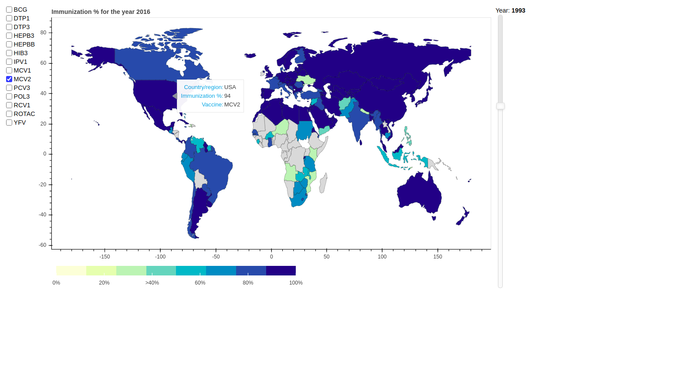

# Creating a World-map dashboard of immunization data using Bokeh
In this post I will demonstrate how to create an interactive dashboard showing country-wise immunization data on a World-map in Python's Bokeh library. This countrywise map is also known as a Chloropleth diagram.

## The dataset
I will use the immunization data set from Unicef which shows the immunization percentages for all years from 1980 till 2019 for all major countries.
 [Source Unicef](https://data.unicef.org/topic/child-health/immunization/)

## Features of the dashboard
The map shows all the countries' political border. The colors shows the percentage of immunization for each country. The **tooltip** shows the vaccine names, country and the percentage of immunization. The **slider** on the right can select the year. On changing the slider the map **updates instantly** showing the data foe the chosen year. The **choiceboxes** on the left can select the drugs the user is interested in. Again, on choosing the **choiceboxes** the map gets updated instantly.

## The File structure
Let us first see the file structure of the project. It is as shown below.

The main.py is the starter file where execution begins. The scripts folder has the main code for generating the chloropleth world map. The data folder has the immunization data in .XLS file and the remaining files are the bundle of SHAPE files that are used for rendering the coundaries of the world map. 

## Running the project

1. Download this project on your PC as a zip file. Unzip the contents. The folder name will be **bokeh-dashboard**.
2. Run the project using the command `bokeh serve --show bokeh-dashboard` from the folder which contains the downloaded folder **bokeh-dashboard**.

Bokeh runs a web server and makes the dashboard available on the local PC on the URL (http://localhost:5006/bokeh-dashboard). 5006 is teh default port on which Bokeh server runs.

## Further steps
The dashboard can be extended to add more tabs so that multiple such interactive dashboards can be displayed in the same app.
Even drill down functionality can be implemented so that the country which is clicked can be shown with its state level details.
